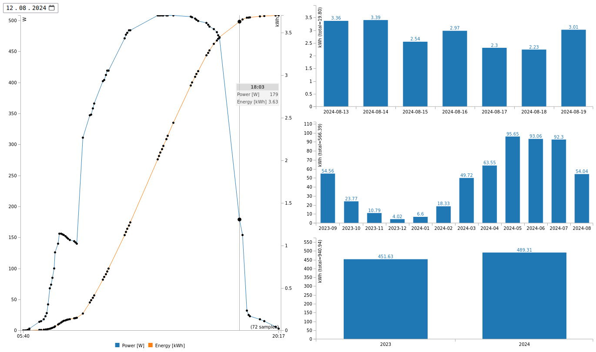

# NEPviewerCR+

**(Partial) NEPViewer replacement for desktop/laptop computers**

Utility file to view selected data uploaded by [NEP micro inverter systems](https://northernep.com/products/microinverters/) to the cloud, instead of using the official iOS/Android NEPViewer app. (Note: This also works for rebranded NEP micro inverters, e.g. those distributed by Anker or Nuasol.)

## Usage

Temporarily disable CORS in your web browser (e.g. using [CORS Everywhere](https://github.com/spenibus/cors-everywhere-firefox-addon) with Firefox, which thankfully automatically enables the CORS security feature again on each start of Firefox),
then load `NEPviewerCR+.html`, with your micro inverter's serial number appended in the address like this `file:///.../NEPviewerCR+.html?SN=efcdab78`. The serial number must be as provided in registering your micro inverter with the [NEPViewer server](https://nepviewer.com/)
Initially the current day's power curve, the most recent seven days', the most recent twelve months', and the most recent years' cumulative energy will be displayed graphically. Using the date selection control in the top left of the screen, the power curve for any other day can be displayed.

**Example:**



### NEP Status

There's also `NEPstatusCR.pl`, which can be used on the command line to get the most recent status of a micro inverter registered with the [NEPViewer server](https://nepviewer.com/).
**Example:**
(Replace `efcdab78` with your micro inverter's serial number!)
```
$ perl NEPstatusCR.pl efcdab78
80 W / 0.048 kWh on 2024-08-20 07:38 (941.257 kWh total)
```
