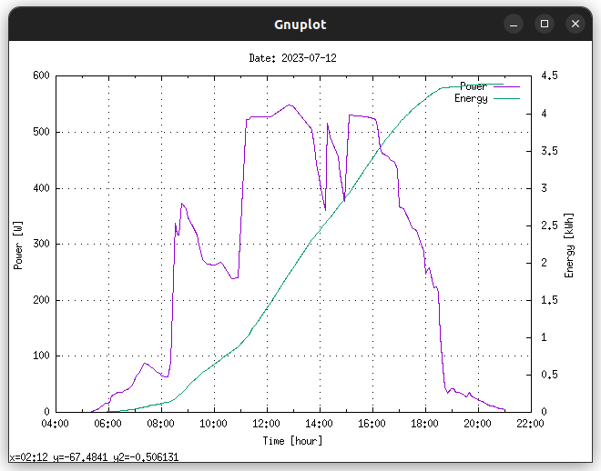

# NEPviewerCR

**(Partial) NEPViewer replacement for desktop/laptop computers**

Utility files to view selected data uploaded by [NEP micro inverter systems](https://northernep.com/products/microinverters/) to the cloud, e.g. to collect that data in a personal database, or to display the current day's details on a desktop/laptop computer instead of using the official iOS/Android NEPViewer app. (Note: This works also for rebranded NEP micro inverters, e.g. those distributed by Anker or Nuasol.)

## Tools Provided

### NEPviewerCR.pl

Perl script to download the current (actually: most recent) day's power values, as transmitted (up to) every five minutes to the cloud. The resulting total energy is also calculated (as the integral of the power curve); note that the calculated energy values are usually off by quite a margin from the (much more realistic) total day's energy value determined by the micro converter system, which is also transmitted to the cloud. The power/energy pairs for each sample timepoint available are printed (e.g. `2023-07-12 12:48 = 548 W`), e.g. to save into a database. The resulting curves are also displayed.

**Requirements:**
- perl (obviously)
- wget (still one of the easiest ways to grab a web page)
- feedgnuplot and the underlying gnuplot (for plotting)
- imagemagick's display command (to show the plots on graphic terminals)
- NEPviewerCR.pl, with *your* micro inverter system's info included!

**Example:**

### NEPviewerCR.html

HTML page to (differently) display the same curves as NEPviewerCR.pl (see above), and to allow some interaction with them.

**Requirements:**
- web browser, with CORS disabled (e.g. using [CORS Everywhere](https://github.com/spenibus/cors-everywhere-firefox-addon) with Firefox)
- NEPviewerCR.hml, with *your* micro inverter system's info included!

**Example:**

### NEPviewerCR_get_todays_energy.sh

Shell script to display the current day's total energy, e.g. `3.6 kWh on 2023-07-12 20:58`.

**Requirements:**
- shell (e.g. bash)
- wget
- perl
- NEPviewerCR_get_todays_energy_sh, with *your* micro inverter system's info included!

## *Required* Modifications

As noted above, the tools provided here *require* you to include information for your micro inverter system. Look for placeholders in the files that are marked like `<<this>>`, and replace them with values for your system, as registered with the [NEP cloud](https://user.nepviewer.com/):
- SID is the system identification (pattern: CC_YYYYMMDD_XXXX)
- SN is the gateway serial number (pattern: efcdab78)
- token is a value used to access your system's data via the NEP cloud's appservice interface. To find out what your token is, capture the data transfer from the NEPViewer (or Nuasol-Viewer, ...) iOS/Android app once (I used the PCAPdroid app on Android for that), and look for the token value there.
