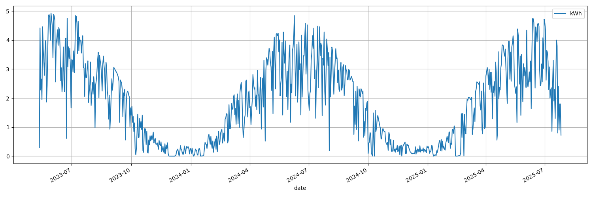

# NEPviewerCR

**NEPViewer supplement for desktop/laptop computers**

Before 2025 (?), [nepviewer.com](https://nepviewer.com)
didn't show most of the data it had received from
NEP micro inverters (including those re-branded by Anker or NuaSol, e.g.)
registered with the site. This led me to creating my own
set of tools to access and display my micro inverter's data stored with NEP.

Since then, the site (and the Android app) have improved, so that they
probably fulfill most users' needs. When NEP changed the API I had used
in my tool set until April 2025, I abandoned my tools and restricted myself
to using NEP's official offering (NEPViewer web site and app).[^1]

[^1]: ...especially
after realizing that NEP now fakes Watt readings in their "minute" plots:
Instead of showing when it received what power reading from the micro
inverters (which could be up to every five minutes, or not at all for longer
periods of time), they pretend to receive a new value every fifteen minutes,
with the power value being somehow interpolated.

...but then I wanted some changes/additions:

* correct figures for monthly production (in already completed months,
  NEP omits the last day)
* more condensed overviews of my PV system's overall performance
  (see examples below)

This is why I created...

## NEPviewerCR++.py

This Python script reads each day's energy production (kWh) from the NEP
server, stores it in a local CSV file (to avoid having to re-fetch already
known data with each run), and displays some informative (at least to me)
plots of the data.

Sadly, NEP doesn't provide older data with its current API, but in case
you had been using `NEPgetCR.py` and `NEPjson2csvCR.py` from
[v2_obsolete](v2_obsolete)
before the NEP API change, `NEPviewerCR++.py` will initially load the
resulting `*.csv` before asking the NEP server for newer data.

To use `NEPviewerCR++.py`, you must provide it with your credentials for
`nepviewer.com` in environment variables, e.g.

`NEP_ACCOUNT=me@home.de NEP_PASSWORD=secret NEPviewerCR++.py`

### Example Plots

