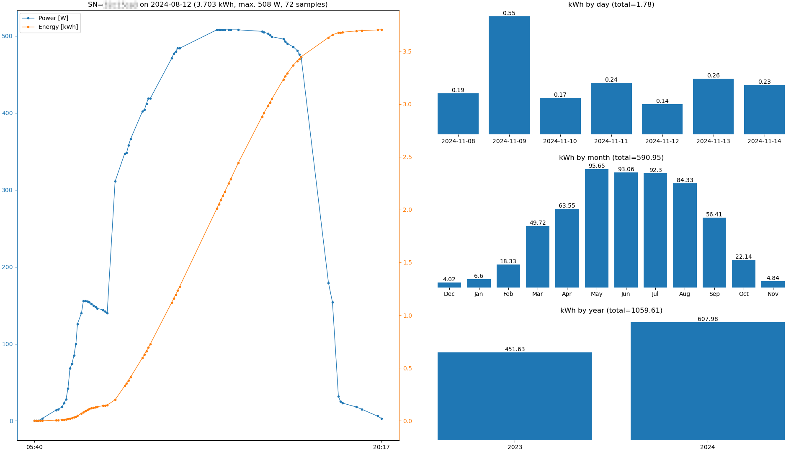
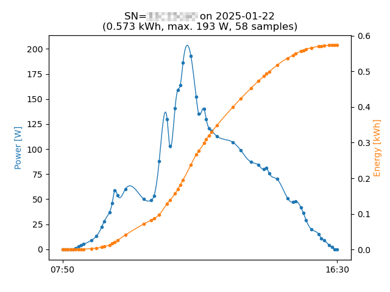
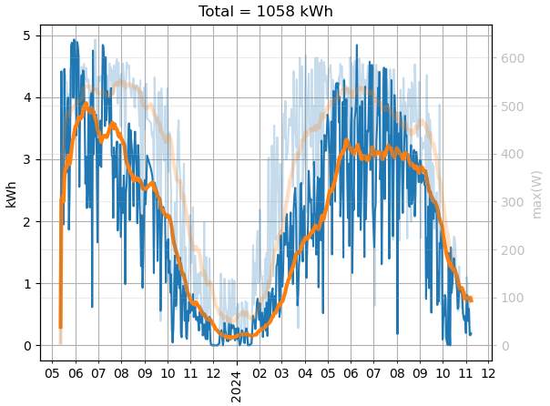
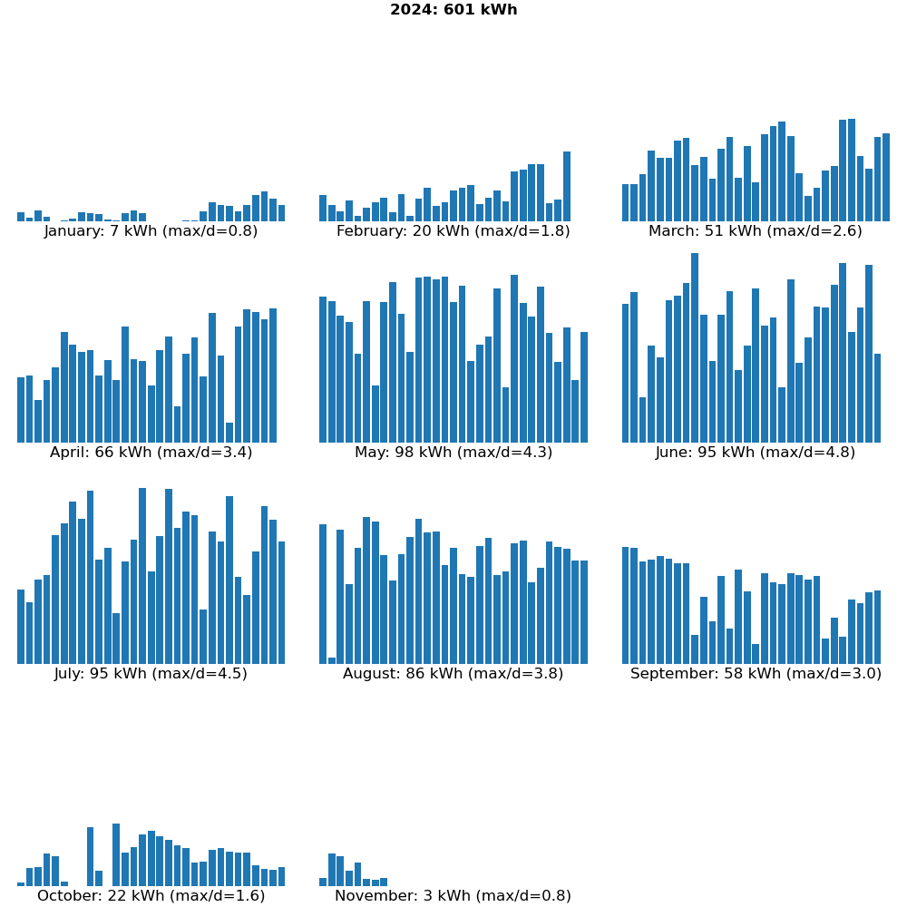
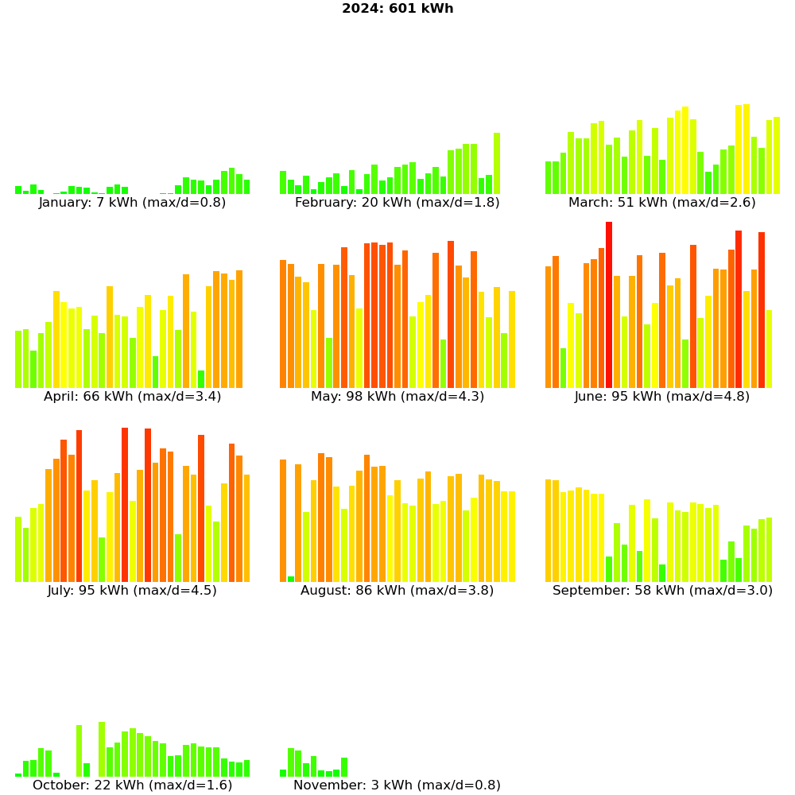
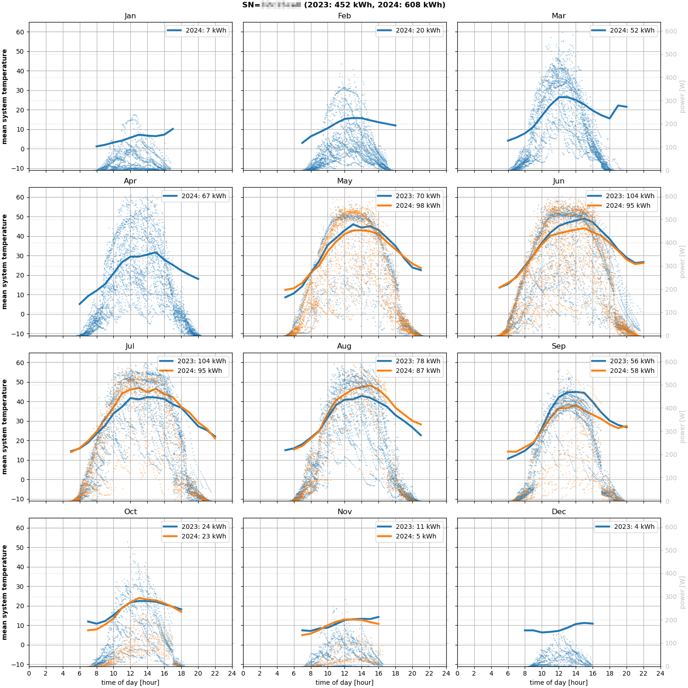

**_Note 2025-04-21: As of today, the nepviewer.com access used by these scripts has been blocked (403 Forbidden)!_**

_P.S. 2025-07-25: If you want to roll your own scripts accessing the current NEP API, https://community.home-assistant.io/t/microinverter-integration-nuasol-northern-electric/591399/19 should get you started._

---

# NEPviewerCR

**(Partial) NEPViewer replacement for desktop/laptop computers**

Utility files to view selected data uploaded by [NEP micro inverter 
systems](https://northernep.com/products/microinverters/) to the cloud, instead 
of using the official iOS/Android NEPViewer app. (Note: This also works for 
rebranded NEP micro inverters, e.g. those distributed by Anker or Nuasol.)

## NEPviewerCR+.html

Use this if you want an interactive day display ... and are willing to do the 
following: Temporarily disable CORS in your web browser (e.g. using [CORS 
Everywhere](https://github.com/spenibus/cors-everywhere-firefox-addon) with 
Firefox, which thankfully automatically enables the CORS security feature again 
on each start of Firefox),
then load `NEPviewerCR+.html`, with your micro inverter's serial number 
appended in the address like this `file:///.../NEPviewerCR+.html?SN=efcdab78`. 
The serial number must be as provided in registering your micro inverter with 
the [NEPViewer server](https://nepviewer.com/).

Initially the current day's power and energy curves, the most recent seven 
days', the most recent twelve months', and the most recent years' cumulative 
energy will be displayed graphically. Using the date selection control in the 
top left of the screen, the power curve for any other day can be displayed.

Try moving your mouse pointer over the day curves or their legend, or
zooming in on that plot for (much) more interactivity! (...with the data
for your solar system, once you see it in your browser, as described here.
The example screenshot I provide below is static.)

Note: In the monthly bars, each complete (!) month's last day's output is missing.
This is exactly as in the original NEPviewer app.

**Example:**


## NEPviewerCR+.py

If a static snapshot of your solar system's performance is sufficient for you 
(or you're not willing to (temporarily) disable CORS in your browser), there's 
also `NEPviewerCR+.py`.

`Usage: python NEPviewerCR+.py serno [yyyymmdd]`

**Example:**



## NEPviewerCR.py

If all you want is a non-interactive plot of a day's power and energy curves, 
you can also use `NEPviewerCR.py`.

`Usage: python NEPviewerCR.py serno [yyyymmdd]`

This uses smoothened curves by default. If you prefer jagged curves, as in the
other tools, set `smooth = False` in the source code.

**Example:**



## NEPstatusCR.py

There's also `NEPstatusCR.py`, which can be used on the command line to get the 
most recent status of a micro inverter registered with the
[NEPViewer server](https://nepviewer.com/).

**Example:**

(Replace `efcdab78` with your micro inverter's serial number!)
```
$ python NEPstatusCR.py efcdab78
80 W / 0.048 kWh on 2024-08-20 07:38 (941.257 kWh total)
```

## NEPgetCR.py

`NEPgetCR.py` can be used to copy your micro inverter's daily output details
to local `*.json` files (placed in the current directory).

`Usage: python NEPgetCR.py serno`

Data for the current day will not be fetched, as it may still be incomplete.

## NEPdaysCR.py

`NEPdaysCR.py` plots your micro inverter's daily output progress (energy and
maximal power readings), using local `*.json` files (see `NEPgetCR.py` above
for how to get those).

`Usage: python NEPdaysCR.py *.json`

**Example:**



## NEPcalendarCR.py

`NEPcalendarCR.py` plots your micro inverter's daily output in a calendar
format, using local `*.json` files (see `NEPgetCR.py` above for how to get
those).

`Usage: python NEPcalendarCR.py *.json`

**Example:**



Should you prefer to have the energy bars colored similar to the original
NepViewer's Watt meter, set `colorful = True` in `NEPcalendarCR.py`.

**Example:**



## NEPjson2csvCR.py

`NEPjson2csvCR.py` compiles data from local `*.json` files (see `NEPgetCR.py`
above for how to get those) into a `*.csv` file for use in spreadsheet
applications e.g.

`Usage: python NEPjson2csvCR.py *.json`

## NEPpowertempCR.py

`NEPpowertempCR.py` uses data from a local `*.csv` (see `NEPjson2csvCR.py`
above) to create a comprehensive view of all (?) of your micro inverter's
interesting data, plotting power readings and mean system temperatures
over time of day in a calendar format, as well as providing cumulative
energy output values.

`Usage: python NEPpowertempCR.py *.csv`

**Example:**


